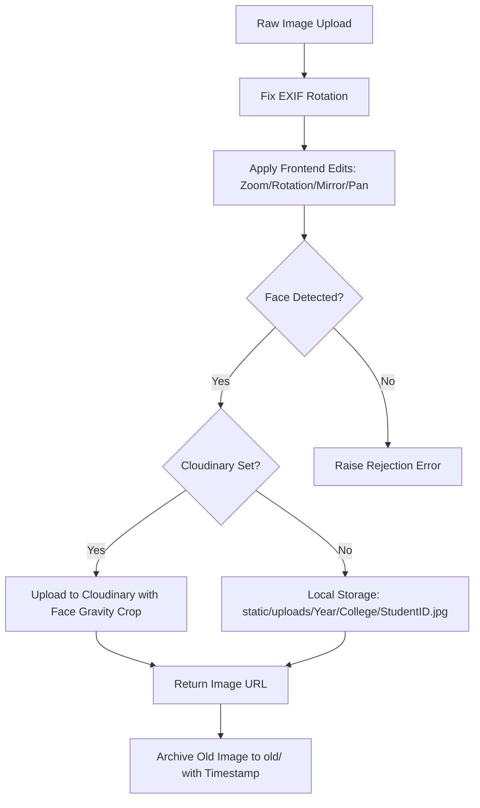

# University Student Registration System (v2.0)

A secure, production-ready, dual-database Flask application for managing university student registrations, processing and validating ID photos, and generating digital student cards.

---

## 📋 Table of Contents
1. [Application Overview](#-application-overview)
2. [Image Processing Architecture](#-image-processing-architecture)
3. [Database Architecture](#-database-architecture)
4. [Code Reference (Files & Functions)](#-code-reference-files--functions)
5. [Production Gaps & Deployment Guide](#-production-gaps--deployment-guide)

---

## 🔍 Application Overview

The **University Student Registration System** is a management portal designed to digitize university ID card collection. The app provides structured workflows for registration staff, college-level admins, system-wide superadmins, and the students themselves.

### Roles & Permissions Matrix
*   **Superadmin**: System-wide controller. Can configure all settings, manage user accounts (create admins and staff), toggle user statuses, and view the global audit log.
*   **Admin**: College-specific manager. Can view, edit, delete, and export student records belonging only to their college.
*   **Staff**: Registration clerk. Can register new students and view student directories, but cannot delete records or manage users.
*   **Student**: End-user. Can self-register using their verified university email domain, upload/crop their card photo, and view/download their digital ID.

### Key Workflows
1.  **Staff/Admin Registration**: Staff manually enter student data, edit the photo using the canvas editor, and register the student.
2.  **Bulk Import**: Admins upload an Excel (`.xlsx`) or CSV sheet of students. The system generates temporary user credentials for each row and emails activation details to the students.
3.  **Student Self-Registration**: Students log in, verify details extracted from their email address, upload/rotate/crop their profile photo, and save their profile to generate a digital student ID.

---

## 📷 Image Processing Architecture

Photos uploaded for university cards must meet strict quality standards (proper crop, frontal alignment, and showing a single human face). The system automates this verification using a multi-step pipeline in [`image_processor.py`](file:///d:/BUA/id%20site/dev/student_v2/image_processor.py):



### 1. Pre-Processing & Normalization
*   **EXIF Correction**: Cameras and mobile phones attach orientation meta-tags to photos. The helper `_fix_exif_rotation` transposes the image arrays to align orientation.
*   **Canvas Transforms**: When a user zooms, pans, mirrors, or rotates the image in the browser, the frontend maps these parameters to coordinates which are sent alongside the image bytes. The backend applies these exact edits via `apply_edits`.

### 2. Double-Pass Face Detection
To ensure accuracy, the server performs face detection:
1.  **Face++ API**: If configured with API credentials, the image is sent to the Face++ Cloud API which runs deep neural networks to detect face geometry.
2.  **OpenCV Cascades (Fallback)**: If credentials are not configured or the network request fails, it falls back to local OpenCV Haar Cascades (using default, alt, and alt2 frontal face classifiers).
3.  **Rejection Gating**: If no face is detected after both passes, the image is rejected and the database transaction is rolled back.

### 3. Smart Face-Cropping
If a face is found, the coordinates of the largest face are used to crop the image:
*   Calculates a `400x500` ratio wrapper.
*   Calculates 28% headroom above the center of the face to ensure a clean headshot.
*   Resizes using Lanczos interpolation to output a standard size (`400px` width by `500px` height) JPEG at 88% quality.

---

## 🗄️ Database Architecture

The application uses a **Dual-Backend Data Access Layer** implemented in [`database.py`](file:///d:/BUA/id%20site/dev/student_v2/database.py):
*   **SQLite** is used when the environment variable `DATABASE_URL` is empty (ideal for zero-setup local development). It is configured to run in WAL (Write-Ahead Logging) mode with foreign keys enabled to prevent file locks.
*   **PostgreSQL** is used if `DATABASE_URL` contains a valid connection URI (such as a production Neon, AWS RDS, or Heroku PG instance).

### Schema Layout
```
   +------------------+         +------------------+         +------------------+
   |      users       |         |     students     |         |    audit_log     |
   +------------------+         +------------------+         +------------------+
   | id (PK)          |         | id (PK)          |         | id (PK)          |
   | email (Unique)   |<--------| email            |         | user_id (FK)     |
   | password_hash    |         | student_id (Uniq)|<--------| action           |
   | role             |         | full_name        |         | target           |
   | college          |         | year             |         | detail           |
   | student_id (Uniq)|         | college          |         | ip               |
   | is_active        |         | image_path       |         | created_at       |
   | email_verified   |         | registered_by(FK)|         +------------------+
   | verify_token     |         | created_at       |
   | reset_token      |         | updated_at       |
   | reset_expires    |         +------------------+
   | created_at       |
   +------------------+
```

### Table Details
1.  **`users`**: Stores credentials and roles. Includes registration verification tokens, password reset hashes, and status toggles.
2.  **`students`**: Stores the student profile. Links to the user who registered them (`registered_by`), and connects to the user record for login credentials.
3.  **`audit_log`**: Captures every administrative action (Logins, Registration, Deletions, Profile Edits, and Data Exports) with timestamps, IP addresses, and targets.

---


### 5. Remaining Polish
*   **Anti-spoofing / Liveness check**: Haar Cascades can detect a printout photo or cartoon drawing as a face. To make it perfect, consider adding frontend liveness tests (like forcing users to blink or turn their head via webcam before snapping the photo).
*   **Automated database backups**: Set up a daily cron job to run `pg_dump` (if using PostgreSQL) or backup the SQLite `students.db` file to secure offsite cloud storage.
