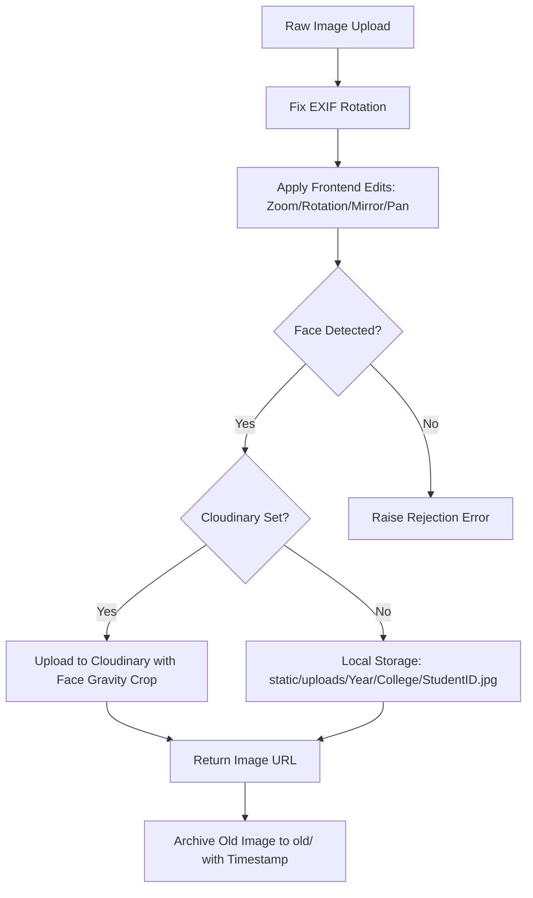

# University Student Registration System (v2.0)

A secure, production-ready, dual-database Flask application for managing university student registrations, processing and validating ID photos, and generating digital student cards.

---

## 📋 Table of Contents
1. [Application Overview](#-application-overview)
2. [Image Processing Architecture](#-image-processing-architecture)
3. [Database Architecture](#-database-architecture)
4. [Code Reference (Files & Functions)](#-code-reference-files--functions)
5. [Production Gaps & Deployment Guide](#-production-gaps--deployment-guide)

---

## 🔍 Application Overview

The **University Student Registration System** is a management portal designed to digitize university ID card collection. The app provides structured workflows for registration staff, college-level admins, system-wide superadmins, and the students themselves.

### Roles & Permissions Matrix
*   **Superadmin**: System-wide controller. Can configure all settings, manage user accounts (create admins and staff), toggle user statuses, and view the global audit log.
*   **Admin**: College-specific manager. Can view, edit, delete, and export student records belonging only to their college.
*   **Staff**: Registration clerk. Can register new students and view student directories, but cannot delete records or manage users.
*   **Student**: End-user. Can self-register using their verified university email domain, upload/crop their card photo, and view/download their digital ID.

### Key Workflows
1.  **Staff/Admin Registration**: Staff manually enter student data, edit the photo using the canvas editor, and register the student.
2.  **Bulk Import**: Admins upload an Excel (`.xlsx`) or CSV sheet of students. The system generates temporary user credentials for each row and emails activation details to the students.
3.  **Student Self-Registration**: Students log in, verify details extracted from their email address, upload/rotate/crop their profile photo, and save their profile to generate a digital student ID.

---

## 📷 Image Processing Architecture

Photos uploaded for university cards must meet strict quality standards (proper crop, frontal alignment, and showing a single human face). The system automates this verification using a multi-step pipeline in [`image_processor.py`](file:///d:/BUA/id%20site/dev/student_v2/image_processor.py):



### 1. Pre-Processing & Normalization
*   **EXIF Correction**: Cameras and mobile phones attach orientation meta-tags to photos. The helper `_fix_exif_rotation` transposes the image arrays to align orientation.
*   **Canvas Transforms**: When a user zooms, pans, mirrors, or rotates the image in the browser, the frontend maps these parameters to coordinates which are sent alongside the image bytes. The backend applies these exact edits via `apply_edits`.

### 2. Double-Pass Face Detection
To ensure accuracy, the server performs face detection:
1.  **Face++ API**: If configured with API credentials, the image is sent to the Face++ Cloud API which runs deep neural networks to detect face geometry.
2.  **OpenCV Cascades (Fallback)**: If credentials are not configured or the network request fails, it falls back to local OpenCV Haar Cascades (using default, alt, and alt2 frontal face classifiers).
3.  **Rejection Gating**: If no face is detected after both passes, the image is rejected and the database transaction is rolled back.

### 3. Smart Face-Cropping
If a face is found, the coordinates of the largest face are used to crop the image:
*   Calculates a `400x500` ratio wrapper.
*   Calculates 28% headroom above the center of the face to ensure a clean headshot.
*   Resizes using Lanczos interpolation to output a standard size (`400px` width by `500px` height) JPEG at 88% quality.

---

## 🗄️ Database Architecture

The application uses a **Dual-Backend Data Access Layer** implemented in [`database.py`](file:///d:/BUA/id%20site/dev/student_v2/database.py):
*   **SQLite** is used when the environment variable `DATABASE_URL` is empty (ideal for zero-setup local development). It is configured to run in WAL (Write-Ahead Logging) mode with foreign keys enabled to prevent file locks.
*   **PostgreSQL** is used if `DATABASE_URL` contains a valid connection URI (such as a production Neon, AWS RDS, or Heroku PG instance).

### Schema Layout
```
   +------------------+         +------------------+         +------------------+
   |      users       |         |     students     |         |    audit_log     |
   +------------------+         +------------------+         +------------------+
   | id (PK)          |         | id (PK)          |         | id (PK)          |
   | email (Unique)   |<--------| email            |         | user_id (FK)     |
   | password_hash    |         | student_id (Uniq)|<--------| action           |
   | role             |         | full_name        |         | target           |
   | college          |         | year             |         | detail           |
   | student_id (Uniq)|         | college          |         | ip               |
   | is_active        |         | image_path       |         | created_at       |
   | email_verified   |         | registered_by(FK)|         +------------------+
   | verify_token     |         | created_at       |
   | reset_token      |         | updated_at       |
   | reset_expires    |         +------------------+
   | created_at       |
   +------------------+
```

### Table Details
1.  **`users`**: Stores credentials and roles. Includes registration verification tokens, password reset hashes, and status toggles.
2.  **`students`**: Stores the student profile. Links to the user who registered them (`registered_by`), and connects to the user record for login credentials.
3.  **`audit_log`**: Captures every administrative action (Logins, Registration, Deletions, Profile Edits, and Data Exports) with timestamps, IP addresses, and targets.

---

## 💻 Code Reference (Files & Functions)

### 1. `app.py` (Main Controller)
Contains route handlers, authentication decorators, configuration bootstrappers, and semantic validation.

| Function | File Location | Description |
| :--- | :--- | :--- |
| `to_eng(s)` | [`app.py:L79`](file:///d:/BUA/id%20site/dev/student_v2/app.py#L79) | Converts Arabic numbers input in forms to standard English digits. |
| `validate_university_email(email)` | [`app.py:L81`](file:///d:/BUA/id%20site/dev/student_v2/app.py#L81) | Ensures the registration email matches the university domain (`@bua.edu.eg`). |
| `validate_full_name(name)` | [`app.py:L85`](file:///d:/BUA/id%20site/dev/student_v2/app.py#L85) | Enforces the quadruple-name constraint (minimally 4 words). |
| `validate_student_id(year, code)` | [`app.py:L90`](file:///d:/BUA/id%20site/dev/student_v2/app.py#L90) | Validates the year bounds (last 10 years) and enforces a 6 or 8-digit code. |
| `extract_student_id_from_email(email)` | [`app.py:L97`](file:///d:/BUA/id%20site/dev/student_v2/app.py#L97) | Parses student ID codes directly from their university email prefix patterns. |
| `hash_pw(pw)` / `check_pw(pw, hashed)`| [`app.py:L106`](file:///d:/BUA/id%20site/dev/student_v2/app.py#L106) | Bcrypt wrapper functions for password hashing and validation. |
| `send_email(to, subject, html)` | [`app.py:L112`](file:///d:/BUA/id%20site/dev/student_v2/app.py#L112) | Sends HTML transactional emails using `Flask-Mail`. |
| `login_required(f)` | [`app.py:L130`](file:///d:/BUA/id%20site/dev/student_v2/app.py#L130) | Decorator that redirects unauthenticated requests to the login screen. |
| `role_required(*roles)` | [`app.py:L138`](file:///d:/BUA/id%20site/dev/student_v2/app.py#L138) | Restricts route execution to specific session roles (e.g., `superadmin`). |
| `add_security_headers(res)` | [`app.py:L67`](file:///d:/BUA/id%20site/dev/student_v2/app.py#L67) | Adds secure HTTP headers (CSP, HSTS, X-Frame-Options, X-Content-Type) to requests. |
| `auth_login()` | [`app.py:L229`](file:///d:/BUA/id%20site/dev/student_v2/app.py#L229) | Handles staff/admin authentication, including session regeneration for safety. |
| `student_login()` | [`app.py:L273`](file:///d:/BUA/id%20site/dev/student_v2/app.py#L273) | Renders and processes the student-specific login portal. |
| `auth_register()` | [`app.py:L318`](file:///d:/BUA/id%20site/dev/student_v2/app.py#L318) | Public self-registration gateway, automatically assigning the `student` role. |
| `auth_verify(token)` | [`app.py:L364`](file:///d:/BUA/id%20site/dev/student_v2/app.py#L364) | Verifies registration verification tokens to activate user accounts. |
| `auth_forgot()` / `auth_reset(token)` | [`app.py:L380`](file:///d:/BUA/id%20site/dev/student_v2/app.py#L380) | Coordinates password recovery requests and token verifications. |
| `dashboard()` | [`app.py:L455`](file:///d:/BUA/id%20site/dev/student_v2/app.py#L455) | Renders stats dashboard counting students and users by college. |
| `register_post()` | [`app.py:L513`](file:///d:/BUA/id%20site/dev/student_v2/app.py#L513) | Endpoint for manual student registration, handles photo editing and face validation. |
| `update_photo(student_id)` | [`app.py:L640`](file:///d:/BUA/id%20site/dev/student_v2/app.py#L640) | Endpoint to replace photos. Protected with strict ownership and college check bounds. |
| `admin_students()` | [`app.py:L700`](file:///d:/BUA/id%20site/dev/student_v2/app.py#L700) | Searches and filters the student database (limited by college for college-admins). |
| `admin_delete(id)` | [`app.py:L745`](file:///d:/BUA/id%20site/dev/student_v2/app.py#L745) | Deletes a student profile and removes their associated image asset from the server. |
| `admin_export()` | [`app.py:L771`](file:///d:/BUA/id%20site/dev/student_v2/app.py#L771) | Exports the student list to a styled Excel sheet (limited to the admin's college). |
| `admin_users()` / `admin_create_user()`| [`app.py:L825`](file:///d:/BUA/id%20site/dev/student_v2/app.py#L825) | Superadmin panel actions for creating and managing college admins and staff. |
| `bulk_import_post()` | [`app.py:L1048`](file:///d:/BUA/id%20site/dev/student_v2/app.py#L1048) | Parses Excel/CSV student lists, creates accounts, and triggers emails in bulk. |
| `student_self_register_post()` | [`app.py:L1313`](file:///d:/BUA/id%20site/dev/student_v2/app.py#L1313) | Gateway for students to complete profile registrations and upload photos. |

### 2. `database.py` (Database Layer)
Coordinates SQL schema deployments, migrations, connections, and system event logging.

| Function | File Location | Description |
| :--- | :--- | :--- |
| `get_db()` | [`database.py:L48`](file:///d:/BUA/id%20site/dev/student_v2/database.py#L48) | Connection factory. Automatically connects to SQLite or PostgreSQL. |
| `placeholder(n)` / `ph()` | [`database.py:L61`](file:///d:/BUA/id%20site/dev/student_v2/database.py#L61) | Returns SQL placeholders query formats: `?` for SQLite, `%s` for PostgreSQL. |
| `init_db()` | [`database.py:L168`](file:///d:/BUA/id%20site/dev/student_v2/database.py#L168) | Generates tables, adds database indexes, and seeds the superadmin account. |
| `log_action(...)` | [`database.py:L227`](file:///d:/BUA/id%20site/dev/student_v2/database.py#L227) | Writes system events into the `audit_log` table for compliance tracking. |

### 3. `image_processor.py` (Image Processing)
Applies rotation/zoom transformations, coordinates face detection algorithms, and crops image formats.

| Function | File Location | Description |
| :--- | :--- | :--- |
| `_fix_exif_rotation(pil_img)` | [`image_processor.py:L54`](file:///d:/BUA/id%20site/dev/student_v2/image_processor.py#L54) | Inspects EXIF meta-tags and auto-rotates mobile photos to correct coordinates. |
| `detect_faces_opencv(image_bytes)` | [`image_processor.py:L87`](file:///d:/BUA/id%20site/dev/student_v2/image_processor.py#L87) | Uses Haar Cascade classifiers to identify frontal faces locally. |
| `detect_face_faceplusplus(image_bytes)`| [`image_processor.py:L125`](file:///d:/BUA/id%20site/dev/student_v2/image_processor.py#L125) | Sends base64 image streams to Face++ API endpoint for cloud face validation. |
| `detect_faces(image_bytes)` | [`image_processor.py:L152`](file:///d:/BUA/id%20site/dev/student_v2/image_processor.py#L152) | Tries Face++ cloud engine first, falling back to local Haar Cascades on failure. |
| `smart_crop_face(image_bytes)` | [`image_processor.py:L182`](file:///d:/BUA/id%20site/dev/student_v2/image_processor.py#L182) | Crops images centered on the largest detected face with standard `4:5` aspect ratios. |
| `apply_edits(...)` | [`image_processor.py:L226`](file:///d:/BUA/id%20site/dev/student_v2/image_processor.py#L226) | Applies canvas transforms (mirror, scale, rotation offsets) from frontend editors. |
| `save_image(...)` | [`image_processor.py:L275`](file:///d:/BUA/id%20site/dev/student_v2/image_processor.py#L275) | Uploads photo to Cloudinary or saves locally inside the designated college folder. |
| `archive_old_image(...)` | [`image_processor.py:L327`](file:///d:/BUA/id%20site/dev/student_v2/image_processor.py#L327) | Archives old images into an `old/` subdirectory with timestamp suffixes. |

---

## 🚀 Production Gaps & Deployment Guide

To deploy this website to a live environment (e.g. VPS or cloud hosting) and make it perfect, complete the following items:

### 1. Environment Setup (.env)
Rename `.env.example` to `.env` in production and configure strong credentials:
*   Set a random `SECRET_KEY` and `JWT_SECRET_KEY` using `python -c "import secrets; print(secrets.token_hex(32))"`.
*   Set your production PostgreSQL URI in `DATABASE_URL`.
*   Set real SMTP parameters (`MAIL_USERNAME` and `MAIL_PASSWORD` with a Gmail App Specific Password) to ensure verification emails reach users.
*   Configure the correct domain in `UNIVERSITY_EMAIL_DOMAIN` (e.g., `bua.edu.eg`).
*   Retrieve API keys for cloud face detection from [Face++ Console](https://www.faceplusplus.com/) and update `FACEPP_API_KEY` / `FACEPP_API_SECRET`.

### 2. Configure Nginx Reverse Proxy
In production, place the application behind Nginx. Nginx handles SSL certificates (HTTPS) and forwards traffic to the WSGI server. 

Example Nginx server block configuration (`/etc/nginx/sites-available/student_v2`):
```nginx
server {
    listen 80;
    server_name yourdomain.com;

    location / {
        proxy_pass http://127.0.0.1:5000;
        proxy_set_header Host $host;
        proxy_set_header X-Real-IP $remote_addr;
        proxy_set_header X-Forwarded-For $proxy_add_x_forwarded_for;
        proxy_set_header X-Forwarded-Proto $scheme;
    }

    # Serve static assets directly through Nginx for speed
    location /static/ {
        alias /var/www/student_v2/static/;
        expires 30d;
        add_header Cache-Control "public, no-transform";
    }
}
```

### 3. Run Gunicorn as a Systemd Daemon
Do not use `python wsgi.py` in production. Instead, run Gunicorn to handle concurrent traffic. Create a systemd service file (`/etc/systemd/system/student.service`):

```ini
[Unit]
Description=Gunicorn instance to serve Student Registration System
After=network.target

[Service]
User=www-data
Group=www-data
WorkingDirectory=/var/www/student_v2
Environment="PATH=/var/www/student_v2/venv/bin"
ExecStart=/var/www/student_v2/venv/bin/gunicorn --workers 4 --bind 127.0.0.1:5000 wsgi:app

[Install]
WantedBy=multi-user.target
```

Enable and start the service:
```bash
sudo systemctl enable student
sudo systemctl start student
```

### 4. Enable HTTPS
Secure connections are required for secure cookie sessions and login forms. Obtain a free SSL certificate from Let's Encrypt using Certbot:
```bash
sudo apt install certbot python3-certbot-nginx
sudo certbot --nginx -d yourdomain.com
```

### 5. Remaining Polish
*   **Anti-spoofing / Liveness check**: Haar Cascades can detect a printout photo or cartoon drawing as a face. To make it perfect, consider adding frontend liveness tests (like forcing users to blink or turn their head via webcam before snapping the photo).
*   **Automated database backups**: Set up a daily cron job to run `pg_dump` (if using PostgreSQL) or backup the SQLite `students.db` file to secure offsite cloud storage.
